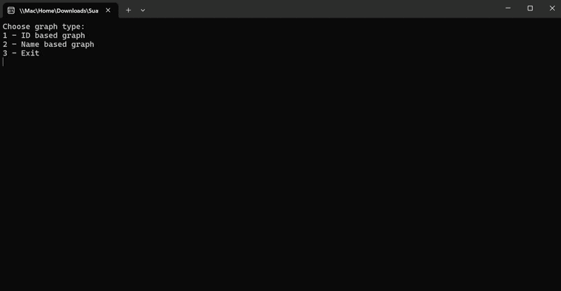

# Graph Based Social Network Analysis 
# Console Application



## Project Overview

A graph data structure application developed using C# to manage and analyze a social network. The application allows users to perform various operations on the graph, such as counting nodes and edges, performing a breadth-first search, and checking the connectivity between two nodes.

## Features

- Count the number of nodes in the graph
- Count the number of edges in the graph
- Perform a breadth-first search and return the list of visited nodes
- Store people's names in the graph and construct a social network
- Check if it's possible to traverse between two people in the network

## Technologies Used

- **Programming Language:** C#
- **Framework:** .NET Framework
- **IDE:** Visual Studio

## Getting Started

### Prerequisites

- Visual Studio 2019 or later

### Installation

1. Clone the repository:

   ```bash
   git clone https://github.com/suatkocar/GraphDataStructureSocialNetwork.git
   ```

2. Open the solution file `Exercise3.sln` in Visual Studio.

3. Build and run the project from Visual Studio.

## License

This project is licensed under the MIT License - see the [LICENSE.md](LICENSE.md) file for details.

## Contact

For any inquiries, please contact me at suatkocar.dev@gmail.com.